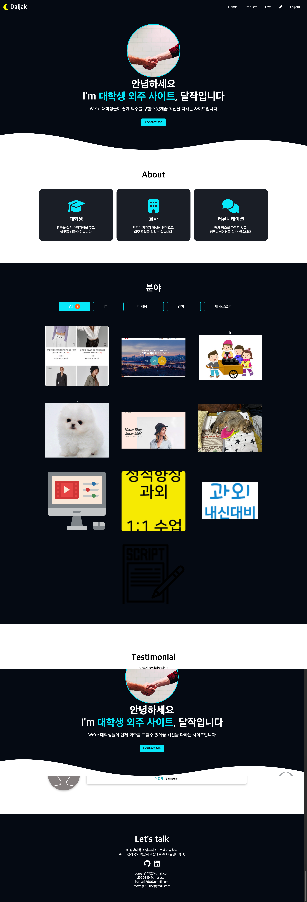
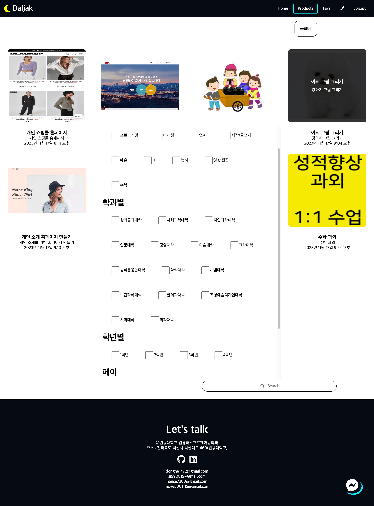
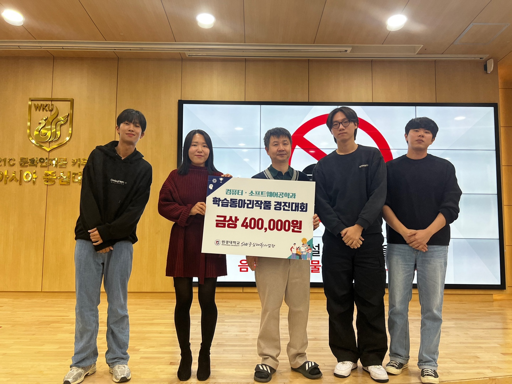
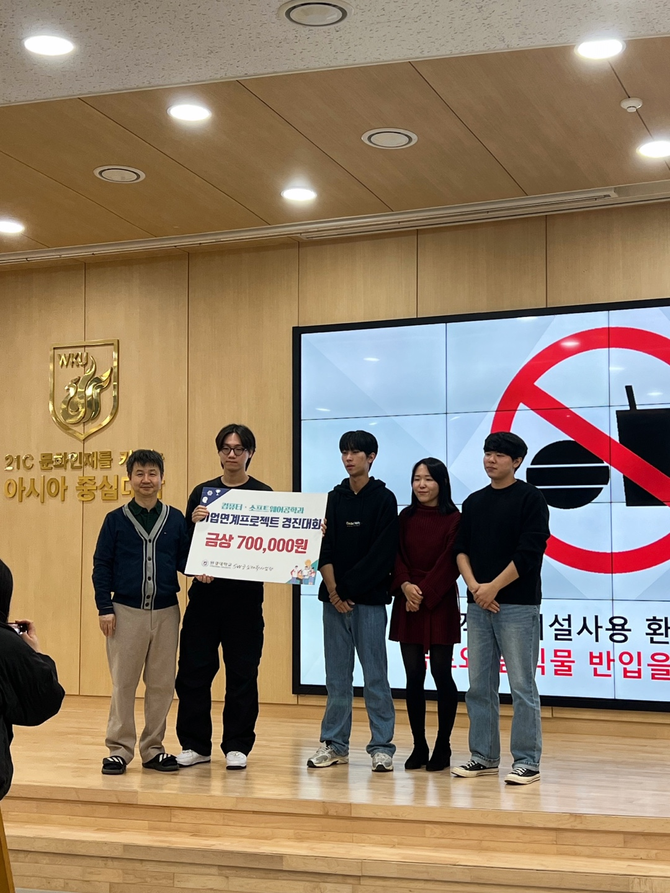

# 대학생 외주 사이트 - 달작

## 소개

안녕하세요! 이 사이트는 대학생들이 다양한 외주 프로젝트를 쉽게 구할 수 있도록 도와주는 플랫폼입니다. 달작은 저렴한 가격으로 대학생과 외주 협회 간의 원활한 소통을 가능하게 하여, 누구나 손쉽게 외주를 맺을 수 있는 사이트입니다.

## 주요 기능

### 분야별 필터링

사용자는 **All, IT, 마케팅, 언어** 등 여러 분야에 걸쳐 원하는 외주를 세분화된 필터링 기능을 통해 손쉽게 찾을 수 있습니다. 이로써 자신이 원하는 분야의 프로젝트를 정확히 검색하고, 해당 외주 프로젝트에 참여할 수 있습니다.

### 학년 및 학과별 필터링

대학생들은 학과와 학년별로 자신에게 맞는 외주 프로젝트를 검색할 수 있습니다. 예를 들어, 특정 학과나 학년에 적합한 프로젝트들을 빠르게 필터링하여, 자신에게 꼭 맞는 프로젝트를 찾아 참여할 수 있습니다.

### 저렴한 외주 비용

달작은 대학생들이 부담 없이 다양한 프로젝트를 수행할 수 있도록 저렴한 비용을 제시합니다. 프로젝트 제공자들은 학생들에게 합리적인 비용으로 외주를 맡길 수 있으며, 학생들은 실무 경험을 쌓을 수 있는 기회를 가집니다.

## 사용 방법

1. **회원가입**: 대학생 또는 외주 의뢰자로 회원가입을 합니다.
2. **프로젝트 검색**: 분야별, 학년별 필터링 기능을 사용하여 원하는 외주 프로젝트를 검색합니다.
3. **외주 의뢰**: 프로젝트 의뢰자는 학생에게 직접 연락하여 외주 작업을 요청합니다.
4. **프로젝트 수행**: 대학생은 의뢰 받은 프로젝트를 성공적으로 완료하고 비용을 지급받습니다.

## 프로젝트 스크린샷

### 홈 페이지

### 제품 페이지

### 2023 종합설계 1등 작품

![2023 종합설계 1등 작품]

이 이미지는 2023 종합설계 경진대회에서 1등을 수상한 작품입니다. 달작은 실용적이고 혁신적인 디자인으로 수상을 하였으며, 외주 서비스를 통해 다양한 프로젝트를 관리할 수 있습니다.

## 기술 스택

- **프론트엔드**: React, CSS
- **백엔드**: Node.js, Express
- **데이터베이스**: MongoDB

## 기여

이 프로젝트에 기여하고 싶다면, 자유롭게 Pull Request를 보내주세요.

## 연락처

- **이메일**: donghe1472@gmail.com
- **웹사이트**: [달작 사이트 링크](https://example.com)
